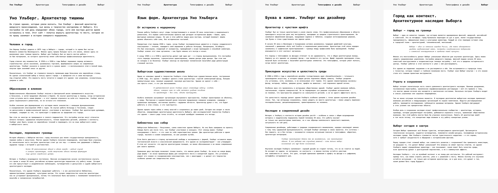

# Домашнее задание №1.

Сверстать микро-сайт. Три-четыре страницы, объединённые общей темой. Навигационное меню. Каждая из страниц содержит осмысленный и законченный текст на любом языке, использующем КИРИЛЛИЦУ для письменности.

Структура каждой из страниц:
— заголовок 1-го уровня;
— не менее трёх заголовков 2-го уровня;
— под каждым из заголовков 2-го уровня не менее трёх абзацев текста. Абзацы содержат более четырёх строк.

Каждая страница содержит врезки — цитаты или выделенные фрагменты текста, привлекающие внимание читателя. Хотя бы первая страница содержит вводный текст (лид) — «трейлер» текста.

Что можно:
По умолчанию — Figma, можно html + css. Допускается использование любого конструктора сайтов (Tilda и т.п.).

Что нельзя:
На сайте не допускается никаких изображений и графики, анимации и градиентов. Не допускается противоречие уголовному кодексу РФ и нормам традиционной морали, а также политика.

## Моя работа:
https://www.figma.com/proto/KVmLzHDzeSBIlNfZe69im0/typography?page-id=0%3A1&node-id=2-5&p=f&viewport=724%2C235%2C0.11&t=s5R4tPd63HK1Qf3p-1&scaling=min-zoom&content-scaling=fixed

